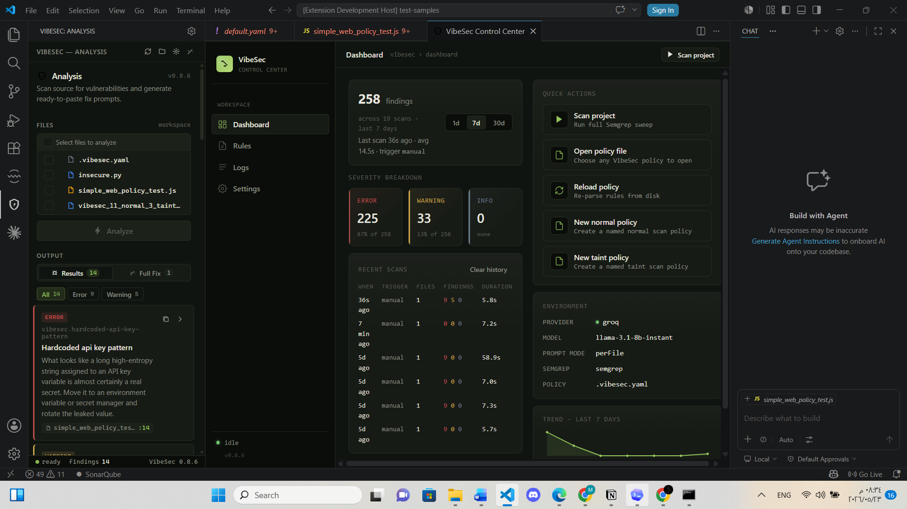
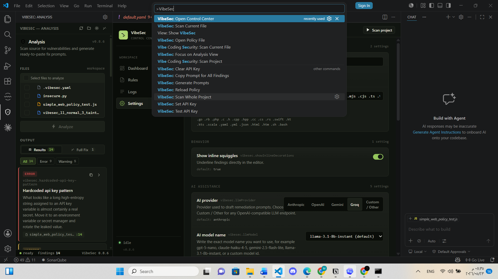

# VibeSec

[](https://github.com/Mosec2525/vibe-coding-security/actions/workflows/ci.yml)
[](LICENSE)

VibeSec is a local-first VS Code extension that scans source code for security issues with Semgrep and turns findings into AI-ready fix prompts. It is built for developers who want fast feedback without sending project code to a remote scanner.

Repository: <https://github.com/Mosec2525/vibe-coding-security>

## What It Does

1. Run `VibeSec: Scan Current File`, `VibeSec: Scan Whole Project`, or right-click files/folders and run `VibeSec: Scan Selected`.
2. VibeSec runs Semgrep locally against bundled or workspace-selected policies.
3. Findings appear in the VibeSec Analysis sidebar with inline diagnostics in the editor.
4. The Control Center opens dashboards, settings, logs, and rule inventory from one place.
5. Optional AI prompt generation creates copy-paste repair prompts per finding, file, or project.

No scanner account, no telemetry, and no cloud backend are required. API keys for optional prompt generation are stored with VS Code SecretStorage.

## Screenshots

### Control Center Dashboard



### Analysis Panel and Fix Prompts


### Command Palette



## Features

| Area | Capability |
| --- | --- |
| Local scanning | Semgrep-backed scans for the current file, selected files/folders, or the whole workspace |
| Policy control | `.vibesec.yaml` selector support, bundled `vibesec:default` and `vibesec:taint` rule files, custom Semgrep-shaped rules |
| Findings UX | Analysis sidebar, inline diagnostics, severity filters, click-to-jump findings, copyable descriptions |
| Control Center | Dashboard, settings, logs, scan history, rule inventory, YAML open actions |
| Taint analysis | Source-to-sink data flow tracking for command injection, SQL injection, path traversal, deserialization, XSS, and SSRF |
| AI assistance | OpenAI, Anthropic, Gemini, Groq, and custom OpenAI-compatible provider support for fix-prompt generation |
| Release hygiene | CI compile/test/audit checks, VSIX file audit script, tag-based VSIX release workflow |

## Requirements

- VS Code 1.85 or later
- Node.js 20 or later for development and release packaging
- Semgrep CLI on `PATH` for running scans

Install Semgrep:

```bash
pip install semgrep
semgrep --version
```

## Installation for Development

```bash
git clone https://github.com/Mosec2525/vibe-coding-security.git
cd vibe-coding-security
npm ci
npm run compile
```

Open the repository in VS Code and press `F5` to launch an Extension Development Host. In the new window, open a source file and run `VibeSec: Scan Current File`.

## Commands

| Command | Description |
| --- | --- |
| `VibeSec: Scan Current File` | Scan the active editor file |
| `VibeSec: Scan Selected` | Scan files or folders selected from Explorer |
| `VibeSec: Scan Whole Project` | Scan every supported file in the workspace |
| `VibeSec: Open Control Center` | Open Dashboard, Settings, Logs, and Rules |
| `VibeSec: Open Policy File` | Create or open `.vibesec.yaml` in the workspace root |
| `VibeSec: Reload Policy` | Reload policy configuration from disk |
| `VibeSec: Set API Key` | Store an AI provider key securely |
| `VibeSec: Clear API Key` | Remove the stored key |
| `VibeSec: Test API Key` | Validate the configured provider, endpoint, model, and key |
| `VibeSec: Generate Prompts` | Generate AI repair prompts for current findings |

## Policy File

Create `.vibesec.yaml` in the workspace root. VibeSec supports two policy styles:

### Selector policy

Use `activePolicyFiles` when you want the Control Center to manage one or more concrete policy files.

```yaml
activePolicyFiles:
  - rules/default.yaml
  - rules/taint.yaml
```

An empty selector is valid and intentionally disables all active policy files:

```yaml
activePolicyFiles: []
```

### Direct policy

Use direct policy fields when you want one workspace file to define presets, filters, and custom rules.

```yaml
presets:
  - vibesec:default
  - vibesec:taint

severity:
  minSeverity: warning

files:
  exclude:
    - "**/node_modules/**"
    - "**/*.test.ts"

rules:
  - id: local.no-eval
    message: "Do not execute user-controlled code."
    severity: ERROR
    languages: [javascript, typescript]
    pattern: eval(...)
```

Use `VibeSec: Open Policy File` to create a starter policy and `VibeSec: Reload Policy` after editing it.

## AI Fix Prompts

VibeSec can build repair prompts for Cursor, Claude Code, ChatGPT, or another coding assistant. The generated prompts include exact file paths, line numbers, rule IDs, severity labels, snippets, taint flow when available, and verification expectations.

Supported providers:

- OpenAI
- Anthropic
- Google Gemini
- Groq
- Custom OpenAI-compatible endpoints

One-time setup:

1. Run `VibeSec: Set API Key`.
2. Pick the provider and store the key in VS Code SecretStorage.
3. Configure `vibesec.llmProvider`, `vibesec.llmModel`, and optional custom endpoint settings from the Control Center or VS Code settings.
4. Run `VibeSec: Generate Prompts`, then copy per-finding, per-file, or project-level prompts from the Analysis panel.

## Development Scripts

| Script | Purpose |
| --- | --- |
| `npm run compile` | Type-check extension code and rebuild bundled webview assets |
| `npm test` | Compile and run Node test suites |
| `npm run audit` | Run `npm audit --audit-level=moderate` |
| `npm run package:ls` | Compile and list files that will be included in the VSIX |
| `npm run package:vsix` | Compile and create a local `.vsix` package |
| `npm run release:dry-run` | Run tests, audit, and VSIX file audit |
| `npm run release:vsix` | Run tests, audit, and create a VSIX |

## CI and Release

Every push and pull request runs:

- `npm ci`
- `npm test`
- `npm run audit`
- `npm run package:ls`

Tag pushes matching `v*.*.*` run the release workflow, build a VSIX, upload it as a workflow artifact, and attach it to the matching GitHub release.

See [docs/release-checklist.md](docs/release-checklist.md) for the release checklist.

## Project Structure

```text
vibe-coding-security/
|-- src/                     Extension activation, scanner, policy, logs, panel, Control Center
|-- design/                  React source for Analysis panel and Control Center
|-- media/                   Activity-bar icon, walkthrough Markdown, built design bundles
|-- rules/                   Bundled Semgrep policy files
|-- test/                    Node test suites for release-critical behavior
|-- test-samples/            Intentionally vulnerable sample project files
|-- docs/                    Screenshots, release documentation, rule references
|-- .github/workflows/       CI and release automation
|-- package.json             VS Code extension manifest and scripts
|-- package-lock.json        Locked npm dependency graph
|-- README.md                User and contributor documentation
```


